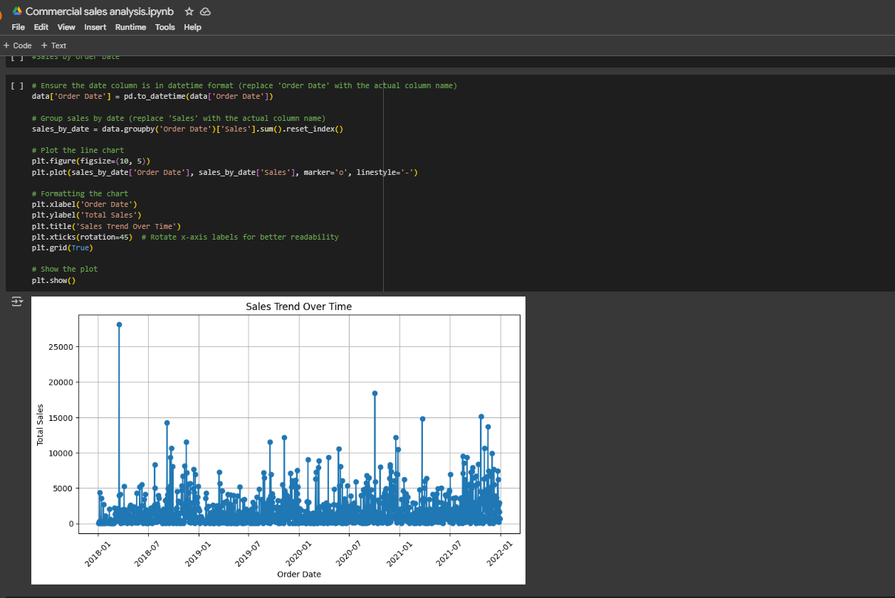
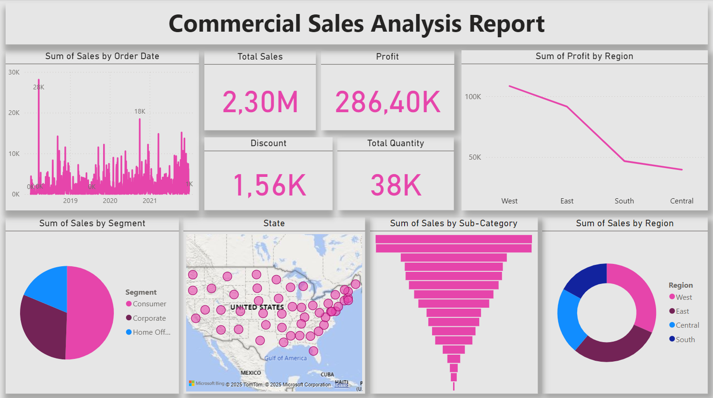
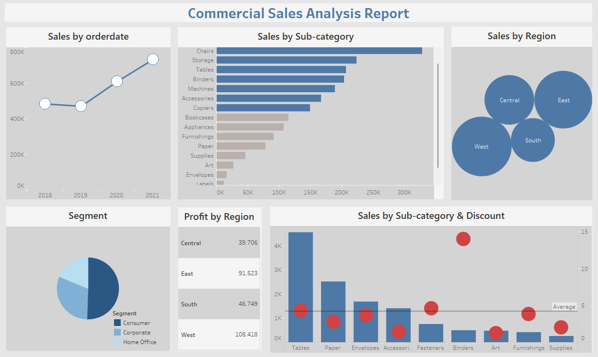

# Commercial Sales Data Analysis and Visualization

Overview
This project focuses on analyzing commercial sales data using Python, Power BI, and Tableau. The objective is to extract valuable insights, visualize trends, and present key metrics for better business decision-making.

# Tools Used
Python (Pandas, Matplotlib, Seaborn, Plotly) – Data cleaning, preprocessing, and exploratory analysis
Power BI – Interactive dashboard for sales insights
Tableau – Advanced data visualization and business intelligence reporting
Project Components

# 1. Python Data Analysis (Jupyter Notebook)

📌 File: Commercial_sales_analysis.ipynb

# Loaded and cleaned sales data
Performed Exploratory Data Analysis (EDA) to identify trends and patterns
#🚀 Created visualizations such as:
Sales trends over time using line charts
Profit distribution across regions
Correlation analysis between discount and sales
Top-selling products and categories
# 🚀 Key insight: 
Sales growth is visible over time, with regional variations in performance

# 2. Power BI Dashboard

📌 Image: CSAR8.png
The Power BI Dashboard is an interactive sales report designed for business intelligence and decision-making.

# Visualizations and Analysis
Sales by Order Date (Line Chart)

# Displays yearly sales trends from 2018 to 2021
Shows an increasing trend in sales, peaking in 2021
Sales by Sub-Category (Bar Chart)

# Highlights the top-selling product categories
Chairs, Tables, and Storage generate the highest revenue
Sales by Region (Bubble Chart)

# Compares total sales across Central, East, West, and South regions
The West region dominates sales, while South has the least sales
Segment Distribution (Pie Chart)

# Segments the market into Consumer, Corporate, and Home Office
The Consumer segment is the largest contributor to sales
Profit by Region (Table)

# Displays profitability across different regions
The West region is the most profitable, while Central has the lowest profit
Sales by Sub-Category & Discount (Bar + Bubble Chart)

# Compares sales with discount rates
Categories with higher discounts (red circles) do not always yield higher sales
#📌 Key Insights from Power BI:
✔️ Sales are growing over time, with 2021 being the peak year
✔️ The West region contributes the highest sales, while Central has the least profit
✔️ Chairs and Tables are the most profitable sub-categories
✔️ The Consumer segment dominates sales, while Home Office has the smallest share

# 2. Tableau Dashboard

📌 Image: CSAR7.png
The Tableau Dashboard provides an interactive and detailed breakdown of commercial sales data.

# Visualizations and Analysis
Sum of Sales by Order Date (Time Series Chart)

# Shows daily sales volume over time
Significant spikes in sales are observed during peak periods
KPI Cards (Total Sales, Profit, Discount, Total Quantity)

# Displays Total Sales (2.30M), Profit (286.40K), Discount (1.56K), and Quantity (38K)
Helps in quick decision-making by highlighting key business metrics
Sum of Profit by Region (Line Chart)

# Visualizes profit trends across different regions
West region has the highest profit, while Central has the lowest
Sum of Sales by Segment (Pie Chart)

# Segments sales into Consumer, Corporate, and Home Office
The Consumer segment is the largest contributor
Sales by State (Geographical Map with Bubble Chart)

# Displays sales distribution across different states in the US
States with higher sales are represented by larger bubbles
Sum of Sales by Sub-Category (Horizontal Bar Chart)

# Highlights the top-selling product categories
Chairs, Tables, and Storage lead in sales volume
Sum of Sales by Region (Pie Chart)

# Breaks down sales distribution by region
The West and East regions account for the majority of sales
📌 Key Insights from Tableau:
✔️ Sales are highest in the West and East regions
✔️ Profitability decreases from West to Central
✔️ High discounts do not always lead to higher sales
✔️ Geographical sales distribution helps identify key market areas

# Key Takeaways from the Project
🔹 Sales trends indicate a steady increase over the years
🔹 The West region consistently performs the best in sales and profit
🔹 Chairs and Tables dominate the sub-category sales
🔹 The Consumer segment is the most profitable market segment
🔹 Regional and product-wise insights help optimize sales strategy

# Files Included in the Repository
📂 Commercial_sales_analysis.ipynb – Jupyter Notebook with Python analysis
📂 CSAR7.png – Power BI Dashboard Screenshot
📂 CSAR8.png – Tableau Dashboard Screenshot

# How to Use This Repository
Explore the Jupyter Notebook to see the Python data analysis
Review the Power BI and Tableau Dashboards for interactive insights
Use the dataset to explore further trends and insights
# Python | Google Colab | PowerBi | Tableau | Excel | Data Analysis | Data Visualisation 
